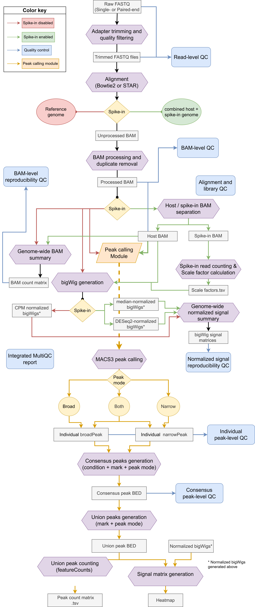

# ChIP-seq Snakemake Pipeline

A modular **ChIP-seq workflow implemented in Snakemake** for read processing, quality control, optional spike-in normalization, and peak calling on SLURM-based HPC systems.

The workflow supports paired-end and single-end sequencing, STAR or Bowtie2 alignment, configurable spike-in normalization, and optional MACS3 narrow and broad peak calling.

## Main features

- Paired-end and single-end sequencing support
- STAR or Bowtie2 alignment
- Spike-in or CPM signal normalization
- MACS3 narrow, broad, or combined peak calling
- Consensus and union peak generation across biological replicates and conditions
- FRiP, peak QC, read-count matrices, and signal heatmaps
- BAM- and bigWig-level reproducibility analyses
- MultiQC reporting
- Rule-specific Conda environments
- SLURM execution through a Snakemake cluster profile

## Workflow overview

The workflow is organized into three main modules: read processing and alignment, quality control and signal normalization, and optional peak calling.

<p align="center">
  
</p>

## Repository structure

```text
.
├── README.md
├── Snakefile_ChipSeq
├── config/
│   └── config.example.yaml
├── docs/
│   ├── chipseq_workflow.png
│   └── chipseq_workflow.drawio
├── envs/
├── metadata/
│   └── samples.example.tsv
├── sbatch/
│   ├── controller.sh
│   └── star_index_generator.sh
├── scripts/
│   ├── generate_peak_metadata.py
│   └── spikein_scale_factors.R
├── slurm_config/
│   ├── config.yaml
│   ├── parseJobID.sh
│   └── slurm_jobscript.sh
└── workflow/
    ├── main_workflow.smk
    ├── main_qc.smk
    └── peak_calling.smk
```
## Requirements

The workflow is designed for execution on a **SLURM-based HPC system** and requires:

- Snakemake
- Conda or Miniconda
- access to a SLURM workload manager

Rule-specific software dependencies are defined in `envs/`. Reference genomes and aligner indices must be prepared in advance and specified in `config/config.yaml`.

## Configuration

Copy the example configuration before running the workflow:

```bash
cp config/config.example.yaml config/config.yaml
```

The main execution modes are controlled from `config/config.yaml`.

### Sequencing layout

```yaml
layout: "PAIRED"
```

Supported values are `PAIRED` and `SINGLE`.

Paired-end FASTQ files can follow common naming conventions such as:

```text
sample_R1_001.fastq.gz
sample_R2_001.fastq.gz
```

or:

```text
sample_R1.fastq.gz
sample_R2.fastq.gz
```

A subset of samples can optionally be selected through `select_samples`. If the field is left empty, all detected samples are processed.

## Alignment

The aligner is selected in the configuration file:

```yaml
aligner: "star"
```

Supported values are star and bowtie2.

Reference paths are defined in the organism-specific configuration section.

## Spike-in normalization

Spike-in normalization can be enabled or disabled directly from the configuration file:

```yaml
spikeIN: "yes"
```

or:

```yaml
spikeIN: "no"
```

### Without spike-in normalization

When disabled, reads are aligned to the main reference and CPM-normalized bigWigs are generated.

### With spike-in normalization

When enabled, reads are aligned to a combined main-organism/spike-in reference. The aligned BAM is split by genome and spike-in read counts are used to calculate normalization factors and generate normalized bigWigs.

Two normalization factors are reported:

- **Median-based** spike-in scaling,
- **DESeq2-derived** spike-in scaling.

For combined references, chromosome or contig names must use distinguishable prefixes so that reads can be separated by organism after alignment. These prefixes must be added to the combined reference genome before generating the STAR index.

```yaml
main_prefix: "hs_"
spikein_prefix: "sc_"
```

For example:

```text
hs_chr1
hs_chr2
...
sc_chrI
sc_chrII
...
```

A SLURM script for generating a STAR genome index is provided in:

```text
sbatch/star_index_generator.sh
```
Adapt the reference paths, Conda environment and SLURM resources to the local HPC system..

## Peak calling

Peak calling is optional and controlled through `config/config.yaml`:

```yaml
calling_peaks: "yes"
```

Supported values are "yes" and "no".

When enabled, MACS3 uses the sample metadata to define IP samples, controls, conditions, replicates, ChIP targets and peak-calling mode.

The metadata path is defined in the configuration file:

```yaml
metadata: "metadata/samples.tsv"
```

An example is provided in:

```text
metadata/samples.example.tsv
```

### Metadata format

The metadata table contains the following columns:

| Column | Description |
|---|---|
| `sample` | Sample name matching the FASTQ prefix |
| `role` | `IP` or `INPUT` |
| `condition` | Experimental condition |
| `replicate` | Biological replicate |
| `mark` | ChIP target or histone mark |
| `control` | Input sample associated with the IP |
| `peak_type` | Peak-calling mode |

Example:

```text
sample                    role   condition   replicate   mark       control               peak_type
H3K27ac_control_rep1      IP     control     1           H3K27ac    Input_control_rep1    narrow
H3K27me3_control_rep1     IP     control     1           H3K27me3   Input_control_rep1    broad
RNAPII_control_rep1       IP     control     1           RNAPII     Input_control_rep1    both
Input_control_rep1        INPUT  control     1
```

A metadata template can also be generated automatically after defining the FASTQ directory and sample selection in `config/config.yaml`:

```bash
python scripts/generate_peak_metadata.py
```

The generated file can then be completed with the experimental information required for peak calling.

### Peak-calling modes

The `peak_type` field determines how MACS3 is run for each IP sample:

| `peak_type` | Behaviour |
|---|---|
| `narrow` | Generate narrow peaks |
| `broad` | Generate broad peaks |
| `both` | Run both narrow and broad peak calling |
| `none` | Do not call peaks for that sample |

MACS3 significance thresholds are configurable:

```yaml
macs3:
  narrow_cutoff: 0.05
  broad_cutoff: 0.1
```

This makes it possible to analyse different ChIP targets within the same project using the peak model most appropriate for each mark.

### Consensus and union peaks

Individual peak sets are combined across biological replicates to generate **condition-level consensus peaks**.

The minimum replicate support can be configured with:

```yaml
consensus_peaks:
  min_replicates: 2
```

Consensus peak sets are subsequently merged into **union peak sets**, which provide a common genomic reference for downstream comparisons.

Individual and consensus peak sets are used for FRiP and peak-level QC. Union peak sets are used for read-count matrices and normalized signal heatmaps.

## Quality control

The workflow performs quality control at multiple stages, including:

- FastQC before and after trimming.
- SAMtools and Picard alignment metrics.
- blacklist read fraction.
- strand cross-correlation with phantompeakqualtools.
- deepTools fingerprint plots.
- BAM-level correlation and PCA.
- normalized bigWig correlation and PCA.
- IP reproducibility analyses when peak calling is enabled.
- MultiQC report.

## Conda environments

Rule-specific Conda environments are defined under:

```text
envs/
```

Snakemake creates and uses these environments automatically when the workflow is launched with `--use-conda`.

The controller itself requires a Conda environment containing Snakemake.

## Running on SLURM

The repository includes a SLURM profile and controller script.

Before launching the workflow, adapt the cluster-specific settings in:

```text
sbatch/controller.sh
slurm_config/config.yaml
slurm_config/slurm_jobscript.sh
```
Check the SLURM partition, log paths, Conda environment, pipeline directory and resource settings.

Submit the workflow with:

```bash
sbatch sbatch/controller.sh
```

The controller builds the Snakemake DAG and submits individual workflow rules as SLURM jobs.

## Main outputs

Depending on the selected configuration, the workflow generates:

- Trimmed FASTQ files.
- Aligned and indexed BAM files when spike-in normalization is enabled.
- Main-organism and spike-in BAMs.
- Spike-in read-count and scale-factor tables.
- CPM- or spike-in-normalized bigWigs.
- QC metrics, PCA, and correlation analyses.
- Individual, consensus and union peak sets
- FRiP and peak-QC tables.
- Union-peak read count matrices.
- Peak-centered signal heatmaps.

Main workflow outputs are written below:

```yaml
paths:
  out_root: "/path/to/results"
```

Rule-specific logs and benchmark files are written below:

```yaml
paths:
  log_root: "/path/to/logs"
```
